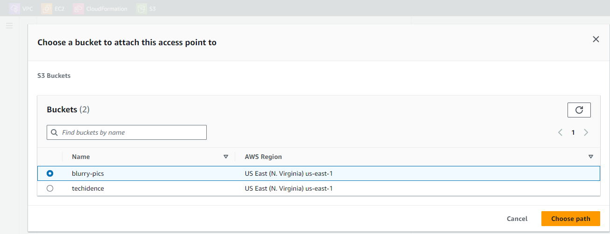

# Object Lambda Access Point

## Overview


This GitHub project aims to create an S3 Object Lambda Access Point that effectively blurs out the faces of individuals in images accessed through the access point. The environment will be set up in the us-east-1 (North Virginia) region, so all references and links provided will be specific to that region. If you plan to deploy the project in a different region, ensure that you adjust the relevant settings accordingly.

Note: To accomplish the face-blurring functionality, our Lambda function will utilize AWS Rekognition, which is only available in specific regions. Please refer to the list of supported regions provided by AWS at [https://aws.amazon.com/about-aws/global-infrastructure/regional-product-services/](https://aws.amazon.com/about-aws/global-infrastructure/regional-product-services/) and select a compatible region.

It's worth mentioning that AWS Rekognition offers a generous free tier, and even outside the free tier period, face detection costs just $0.001 per detection. Furthermore, no cleanup is required after this demonstration.

## Instructions

### Stage 1 - Creating the IAM policy and role

1. Open the IAM console by visiting [https://us-east-1.console.aws.amazon.com/iamv2/home](https://us-east-1.console.aws.amazon.com/iamv2/home).

2. Navigate to "Policies" and click on the "Create policy" button.

	

3. Switch to the JSON tab and enter the following policy configuration:

	```json
	{
		"Version": "2012-10-17",
		"Statement": [
			{
				"Effect": "Allow",
				"Action": "logs:CreateLogGroup",
				"Resource": "arn:aws:logs:*:*:*"
			},
			{
				"Effect": "Allow",
				"Action": [
					"logs:CreateLogStream",
					"logs:PutLogEvents"
				],
				"Resource": [
					"arn:aws:logs:*:*:log-group:/aws/lambda/*:*"
				]
			},
			{
				"Effect": "Allow",
				"Action": [
					"rekognition:DetectFaces",
					"s3-object-lambda:WriteGetObjectResponse"
				],
				"Resource": "*"
			}
		]
	}
	```

	

This policy grants the Lambda function the necessary permissions to create a log group, publish logs to the log group, utilize the "DetectFaces" API from AWS Rekognition, and most importantly, return a response using the S3 Object Lambda "WriteGetObjectResponse" function.

4. Click on the "Tags" button.

5. Proceed to the "Review" section.

6. Provide a name for the policy, such as `s3-lambda-blur-faces`.

7. Click on the "Create policy" button.

8. Navigate to "Roles" and click on the "Create role" button.

	

9. On the "Select type of trusted entity" page, leave "AWS service" selected and choose "Lambda".

	

10. Under "Permissions," search for and select the `s3-lambda-blur-faces` policy you created earlier.

	

11. Click on the "Next" button.

12. Set the role name as `s3-lambda-blur-faces`.

13. Finally, click on the "Create role" button to create the role.

## Stage 2 - Lambda Function Creation

To create the Lambda function, follow these steps:

1. Access the Lambda console by visiting the following link: [https://us-east-1.console.aws.amazon.com/lambda/home?region=us-east-1#/functions](https://us-east-1.console.aws.amazon.com/lambda/home?region=us-east-1#/functions).

2. Go to the "Functions" section and click on the "Create function" button.

   

3. Set the function name as `make-face-blurry`.

4. Change the runtime to Python 3.9.

5. Expand the "Permissions" pane and select the option "Use an existing role." Search for the `s3-lambda-blur-faces` role that was created in the previous stage.

   

6. Click on the "Create function" button.

The function code provided below will be used for this Lambda function. You don't need to copy and paste it anywhere; it is provided for your reference.

	```python
	import boto3
	from PIL import Image, ImageFilter
	import requests
	import io

	s3 = boto3.client('s3')
	rekognition = boto3.client('rekognition')

	def lambda_handler(event, context):
		get_context = event["getObjectContext"]
		route = get_context["outputRoute"]
		token = get_context["outputToken"]
		s3_url = get_context["inputS3Url"]

		# Download the original image from S3
		image_request = requests.get(s3_url)
		image = Image.open(io.BytesIO(image_request.content))

		# Detect faces in the image using Amazon Rekognition
		response = rekognition.detect_faces(Image={'Bytes': image_request.content})
		faces = response['FaceDetails']
		
		# Blur out the faces in the image
		for face in faces:
			box = face['BoundingBox']
			x1 = int(box['Left'] * image.width)
			y1 = int(box['Top'] * image.height)
			x2 = int((box['Left'] + box['Width']) * image.width)
			y2 = int((box['Top'] + box['Height']) * image.height)
			face_image = image.crop((x1, y1, x2, y2))
			blurred_face = face_image.filter(ImageFilter.BoxBlur(radius=10))
			image.paste(blurred_face, (x1, y1, x2, y2))

		
		# Save the resulting image to memory
		output = io.BytesIO()
		image.save(output, format=image.format)
		output_content = output.getvalue()

		# Save the image and return the object response
		s3 = boto3.client('s3')
		s3.write_get_object_response(Body=output_content, RequestRoute=route, RequestToken=token)

		return {
			'statusCode': 200
		}
	```

To proceed with the setup:

1. Download the `function.zip` file from the "lambda" folder in the GitHub repository associated with this project.

2. In the Lambda console, click on "Upload from" and select the option "`.zip file`".

   

3. Click on "Upload" and choose the downloaded `function.zip` file.

   

4. Click on "Save" to complete the process.

Copying and pasting the code above directly into the Lambda function is not possible due to the required Python libraries that are not available by default. The `function.zip` file contains both the function code and the necessary libraries. Refer to the following documentation for instructions on creating a package with dependencies: [https://docs.aws.amazon.com/lambda/latest/dg/python-package.html#python-package-create-package-with-dependency](https://docs.aws.amazon.com/lambda/latest/dg/python-package.html#python-package-create-package-with-dependency)

Next, follow these steps to configure the Lambda function:

1. Navigate to the "Configuration" tab and click on "General configuration." Then, click on "Edit".

   

2. Adjust the timeout value to 0 minutes and 30 seconds.

   

3. Click on "Save".

The reason for increasing the timeout is that the original 3-second duration might not be sufficient for the image manipulation process performed by this function. As described in the code above, the Lambda function retrieves the file from Amazon S3, sends the image to AWS Rekognition for face detection, receives the response containing the face coordinates, applies blurring to the detected faces, and finally returns the modified object to Amazon S3. These operations can take more time, hence the timeout extension.

## Stage 3 - Setting up S3 Buckets and Access Points

To begin configuring the S3 buckets and access points, follow these steps:

1. Access the S3 console by visiting the following link: [https://s3.console.aws.amazon.com/s3/buckets?region=us-east-1](https://s3.console.aws.amazon.com/s3/buckets?region=us-east-1).

2. Navigate to the Buckets section and click on the "Create bucket" button.

   

3. Specify a unique name for the bucket (remember that bucket names must be unique within the region). For this demonstration, let's use `blurry-pics` as the bucket name.

4. Ensure that you select the same region where your Lambda function is deployed. In this case, it is `us-east-1`.

   

5. Click on the "Create bucket" button to create the bucket.

6. Proceed to the Access Points section and click on the "Create access point" button.

   

7. Choose a suitable name for the access point. For instance, let's use `blurry-pics-ap`.

8. Click on the "Browse S3" button next to the Bucket name field.

   

9. Select the bucket you created in the previous step and click on the "Choose path" button.

   

10. Set the Network origin to "Internet".

    

11. Leave all other options unchanged and click on the "Create access point" button.

12. Proceed to the Object Lambda Access Points section and click on the "Create Object Lambda Access Point" button.

    

13. Provide a suitable name for the Object Lambda Access Point. Let's use `blurry-pics-oap` for this example.

14. Ensure that the selected region matches the region of your Lambda function (in this case, `us-east-1`).

15. Under Supporting Access Point settings, click on the "Browse S3" button.

    

16. Select the access point you created in the previous step and click on the "Choose supporting Access Point" button.

    

17. In the Transformation configuration section, choose "GetObject".

    

18. Select the Lambda function you created in the previous step from the Lambda function dropdown.

    

19. Leave all other settings as default and click on the "Create Object Lambda Access Point" button.

Note: In a production environment, it is advisable to apply appropriate policies to the Object Lambda Access Point or the Access Point. However, for the purposes of this demonstration, we will leave the policies unchanged.

## Stage 4 - Testing the Access Point

To test the configured access point, follow these steps:

1. Go to the S3 console by visiting the following link: [https://s3.console.aws.amazon.com/s3/buckets?region=us-east-1](https://s3.console.aws.amazon.com/s3/buckets?region=us-east-1).

2. Navigate to the Buckets section and open the bucket that was created earlier.

   

3. Prepare some photos of people, either personal photos or images obtained from the internet. For this demonstration, you can use the following website: [https://www.freepik.com/photos/people](https://www.freepik.com/photos/people)

4. Within the bucket, click on the "Upload" button.

5. Select the "Add files" option.

   

   Note: Ensure that only JPEG or PNG files are uploaded, as the basic Lambda function provided will return errors if a non-image file is retrieved.

6. After selecting the files, click on the "Upload" button.

   

7. The demo bucket now contains photos of people. If you open any of these images directly from the bucket, you will see the original image.

   

   

8. Return to the S3 console and navigate to the Object Lambda Access Points section. Open the Access Point that was created.

   

9. You will notice the same set of files. However, this time, if you open them, you will retrieve them through the Object Lambda Access Point, and the Lambda function will modify the files accordingly.

   Select any image and click on the "Open" button.

   

10. The image displayed will now have blurred faces (assuming the image contains people's faces).

    
	
	

## Stage 5 - Optional: Testing Access Point via Command Line Interface (CLI)

1.	Before proceeding, please ensure that you have the AWS Command Line Interface (CLI) installed on your computer. You can follow the instructions provided in the following link: [https://docs.aws.amazon.com/cli/latest/userguide/getting-started-install.html](https://docs.aws.amazon.com/cli/latest/userguide/getting-started-install.html)

2.	Next, you will need to obtain an Access Key and Secret Key for your AWS IAM User. To do this, click on the account details button located in the top-right corner of the console and select <kbd>Security credentials</kbd>.

3.	This will direct you to the IAM page associated with your AWS user. Scroll down to Access Keys and click on <kbd>Create access key</kbd>.

4.	On the next page, choose "Other" and click <kbd>Next</kbd>.

5.	Set the description as "S3 Object Lambda Demo" and click <kbd>Create access key</kbd>.

6.	Once you have your command line interface open, run the command `aws configure` and enter the Access Key when prompted.

7.	Next, enter the Secret Key when prompted.

8.	Specify the default region, which should be the region where you created your Lambda and S3 Access Points (e.g., `us-east-1`).

9.	Leave the default output format as is.

Now, your CLI is configured with the necessary permissions associated with your AWS user in the console.

10.	Let's proceed with downloading an image through the regular S3 Access Point. Navigate to the S3 console, go to Access Points, and select the access point you created.

	

11.	Click on any of the available images.

	

12.	On the Properties tab, copy the S3 URI.

	

13.	In your CLI, execute the following command to retrieve the S3 object (replace `<COPIED S3 URI HERE>` with the text you copied from the console).

	```json
	aws s3 cp <COPIED S3 URI HERE> .
	```

This command instructs S3 to copy the object from S3 to your local machine.

14.	Upon successful execution, you should see the image you just downloaded from S3 without blurred faces in the directory where your CLI is currently located.

	

15.	Now, let's repeat the same process using the Object Lambda Access Point. Go to the S3 console and navigate to Object Lambda Access Points. Select your access point.

	

16.	Proceed to the Properties tab and copy the Object Lambda Access Point Alias.

	

17.	Return to your CLI and execute the following command. Note that the alias you copied does not include the object file name. In my case, I will be downloading 'man-isolated-showing-emotions-end-gestures_1303-30095.jpg' so I need to append it to the source. Replace `blurry-pics-oap-o7yc8yjdikpfong9tfqjugeiuse1a--ol-s3` with the text you copied, ensuring that `s3://` is included at the beginning.

	```json
	aws s3 cp s3://blurry-pics-oap-o7yc8yjdikpfong9tfqjugeiuse1a--ol-s3/man-isolated-showing-emotions-end-gestures_1303-30095.jpg .
	```

18.	After executing this command, the new file should be downloaded, replacing the previous file (unless you selected a different file in S3). This time, the downloaded image will have blurred faces.

	

## Stage 6 - Cleanup

To clean up the resources created in this project, perform the following steps:

1. Access the S3 console: [https://s3.console.aws.amazon.com/s3/buckets](https://s3.console.aws.amazon.com/s3/buckets?region=us-east-1&region=us-east-1)

2. Navigate to Object Lambda Access Points, select your access point, and click <kbd>Delete</kbd>.

	

3. Enter the access point name in the confirmation window and click <kbd>Delete</kbd>.

4. Go to Access Points, select your access point, and click <kbd>Delete</kbd>.

	

5. Enter the access point name in the confirmation window and click <kbd>Delete</kbd>.

6. Proceed to Buckets, select the bucket you created earlier, and click <kbd>Empty</kbd>.

	

7. Enter "*permanently delete*" in the confirmation window and click <kbd>Empty</kbd>.

8. Then, select the bucket again, and click <kbd>Delete</kbd>.

	

9. Enter the bucket name in the confirmation window and click <kbd>Delete</kbd>.

10. Access the Lambda console: [https://us-east-1.console.aws.amazon.com/lambda](https://us-east-1.console.aws.amazon.com/lambda)

11. Go to Functions, select the `make-face-blurry` function, click <kbd>Actions</kbd>, and then click <kbd>Delete</kbd>.

	

12. Type "delete" in the confirmation box and click <kbd>Delete</kbd>.

13. Access the CloudWatch console: [https://us-east-1.console.aws.amazon.com/cloudwatch](https://us-east-1.console.aws.amazon.com/cloudwatch)

14. Navigate to Log Groups, select the log group for your Lambda (should be named `/aws/lambda/make-face-blurry`), click <kbd>Actions</kbd>, and then select <kbd>Delete log group(s)</kbd>.

15. Click <kbd>Delete</kbd> in the confirmation box.

16. Access the IAM console: [https://us-east-1.console.aws.amazon.com/iamv2/home#/roles](https://us-east-1.console.aws.amazon.com/iamv2/home#/roles)

17. Go to Roles, select the role created in stage 1 (`s3-lambda-blur-faces`), and click <kbd>Delete</kbd>.

	

18. Enter the role name in the confirmation box and click <kbd>Delete</kbd>.

19. Go to Policies, select the policy created earlier (`s3-lambda-blur-faces`), and click <kbd>Actions</kbd>, then <kbd>Delete</kbd>.

	

20. Enter the policy name in the confirmation box and click <kbd>Delete</kbd>.

21.	If you completed stage 5 and would like to remove the access key for your IAM User, navigate back to the Security Credentials page.

	

22.	Scroll down to Access keys and click <kbd>Actions</kbd> next to the access key you created (ensure you select the access key created for this project), and select <kbd>Delete</kbd>.

23.	Click <kbd>Deactivate</kbd>.

	

24.	Enter your access key and click <kbd>Delete</kbd>.

	
